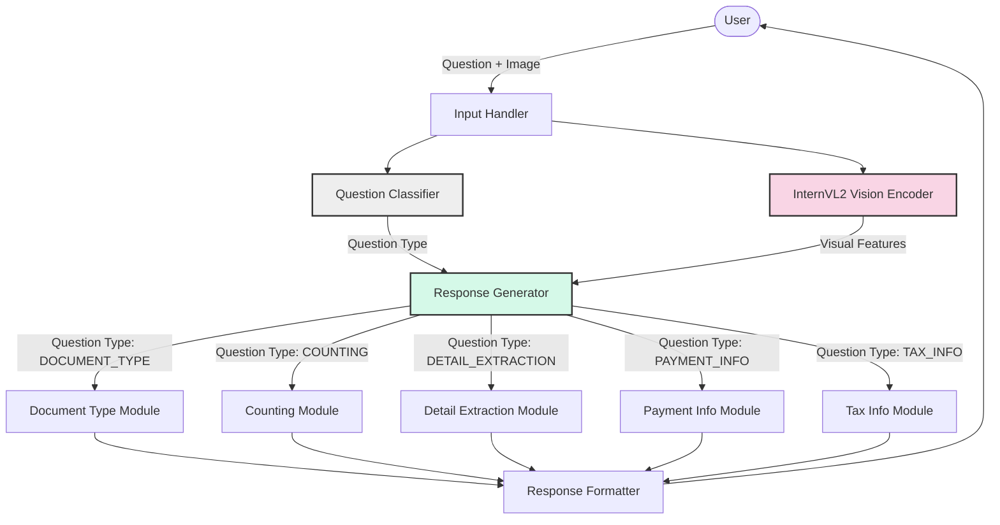
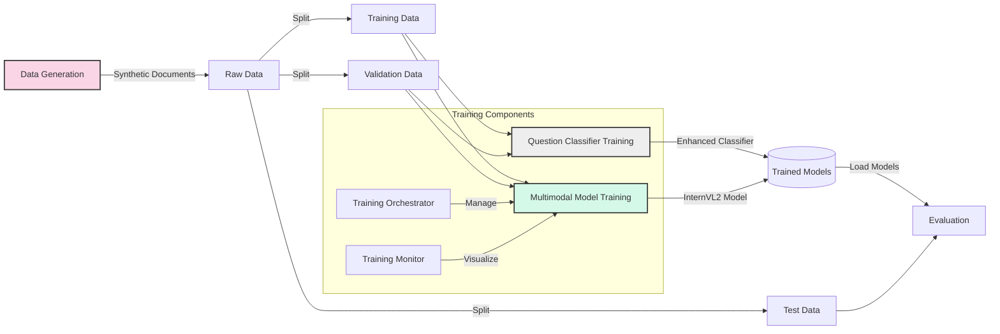
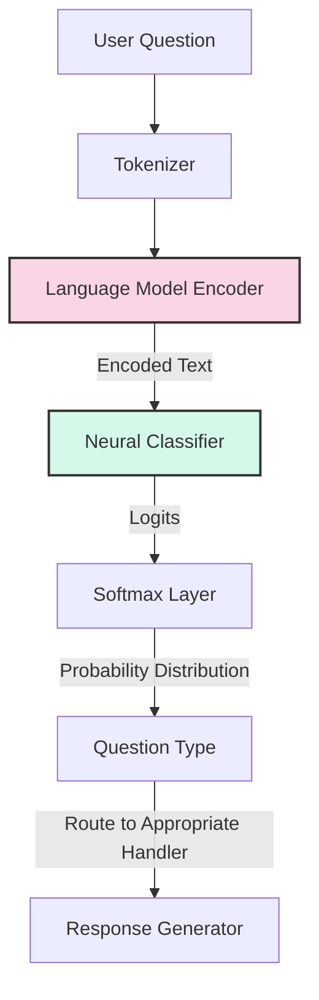
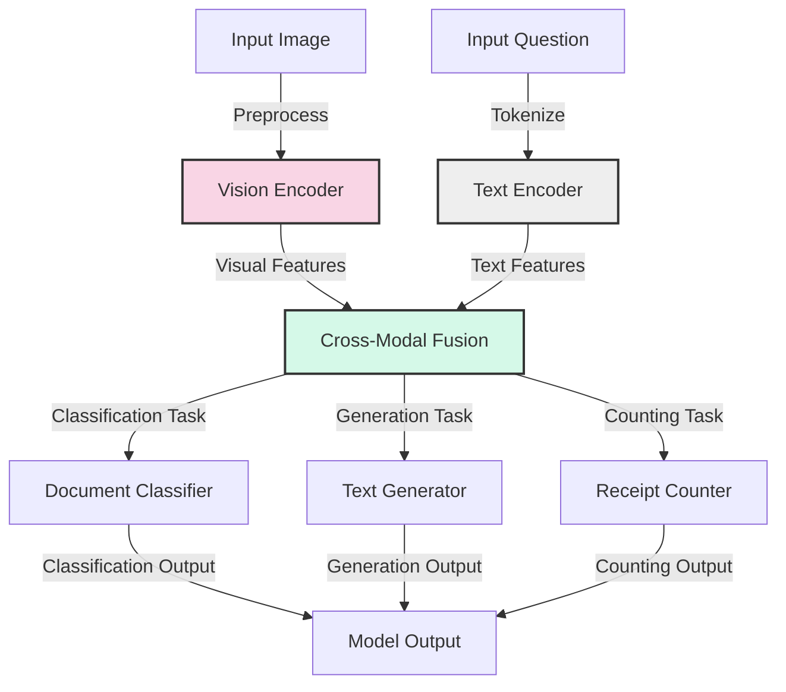

# InternVL_V2 

Vision-language model for receipt and tax document analysis with enhanced question classification, synthetic data generation, and response templates.

## Project Overview

This project extends the InternVL vision-language model for document analysis focusing on three key components:

1. **Enhanced Question Classification**: Accurately classify user questions to select appropriate response templates
2. **Synthetic Data Generation**: Create realistic synthetic receipts and tax documents for training
3. **Template-based Response Generation**: Use structured templates to generate consistent responses

## System Architecture

### Overall System Architecture



### Training Pipeline Architecture



### Question Classification Flow



### Multimodal Processing Architecture



## Directory Structure

The project is organized into the following structure:

- **config/**: Configuration files for all components
  - `classifier/`: Question classifier configurations
  - `data_generation/`: Data generation configurations
  - `model/`: Model training configurations

- **data/**: Data processing and dataset modules
  - `datasets/`: Dataset class definitions
  - `generators/`: Synthetic data generation modules

- **models/**: Model implementations
  - `classification/`: Question classifier models
  - `components/`: Shared model components
  - `vision_language/`: Vision-language model implementations

- **scripts/**: Executable scripts for all tasks
  - `classification/`: Question classification scripts
  - `data_generation/`: Data generation scripts
  - `training/`: Model training and evaluation scripts

- **utils/**: Utility functions used across the project

## Installation

```bash
# Clone the repository
git clone https://github.com/yourusername/InternVL_V2.git
cd InternVL_V2

# Create conda environment from environment.yml
conda env create -f environment.yml

# Activate environment
conda activate internvl_env
```

## Usage

### Question Classification

Train the enhanced question classifier:

```bash
PYTHONPATH=. python scripts/classification/train_enhanced_classifier.py --num-epochs 15
```

Test the classifier:

```bash
PYTHONPATH=. python scripts/classification/test_enhanced_classifier.py
```

### Synthetic Data Generation

Generate synthetic receipts and tax documents:

```bash
PYTHONPATH=. python scripts/data_generation/generate_data.py --output_dir datasets/synthetic_receipts
```

### InternVL Model Training

Train the multimodal vision-language model:

```bash
PYTHONPATH=. python scripts/training/train_multimodal.py --config config/model/multimodal_config.yaml
```

Evaluate the model:

```bash
PYTHONPATH=. python scripts/training/evaluate_multimodal.py --model_path models/multimodal/best_model.pt
```

## Components

### Question Classifier

The enhanced question classifier categorizes questions into 5 types:
- DOCUMENT_TYPE: Questions about the type of document
- COUNTING: Questions about counting documents
- DETAIL_EXTRACTION: Questions about specific details in the document
- PAYMENT_INFO: Questions about payment methods
- TAX_INFO: Questions about tax-related information

### Data Generators

The project includes synthetic data generators for:
- Australian receipts with realistic product listings, pricing, and layouts
- Australian tax documents with proper formatting and tax-specific fields

### Vision-Language Model

Based on InternVL, extended with:
- Question classification component
- Template-based response generation
- Detail extraction capabilities

## Contributing

Contributions are welcome! Please follow these steps:

1. Fork the repository
2. Create a feature branch (`git checkout -b feature/amazing-feature`)
3. Make your changes
4. Commit your changes (`git commit -m 'Add amazing feature'`)
5. Push to the branch (`git push origin feature/amazing-feature`)
6. Open a Pull Request