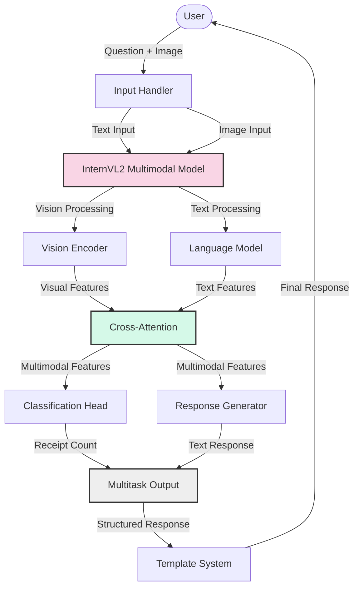
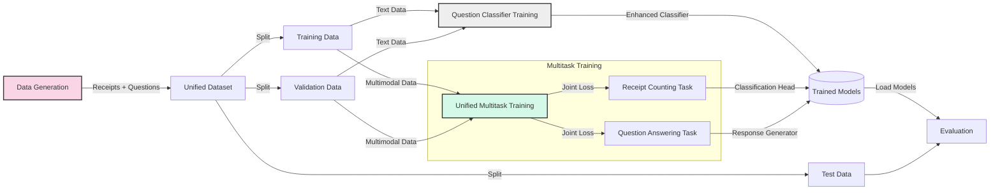
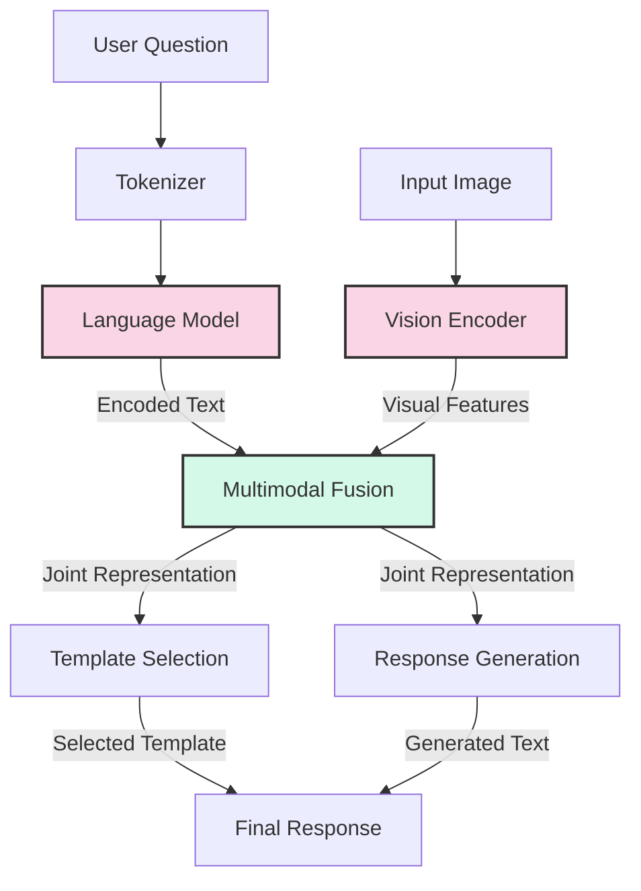
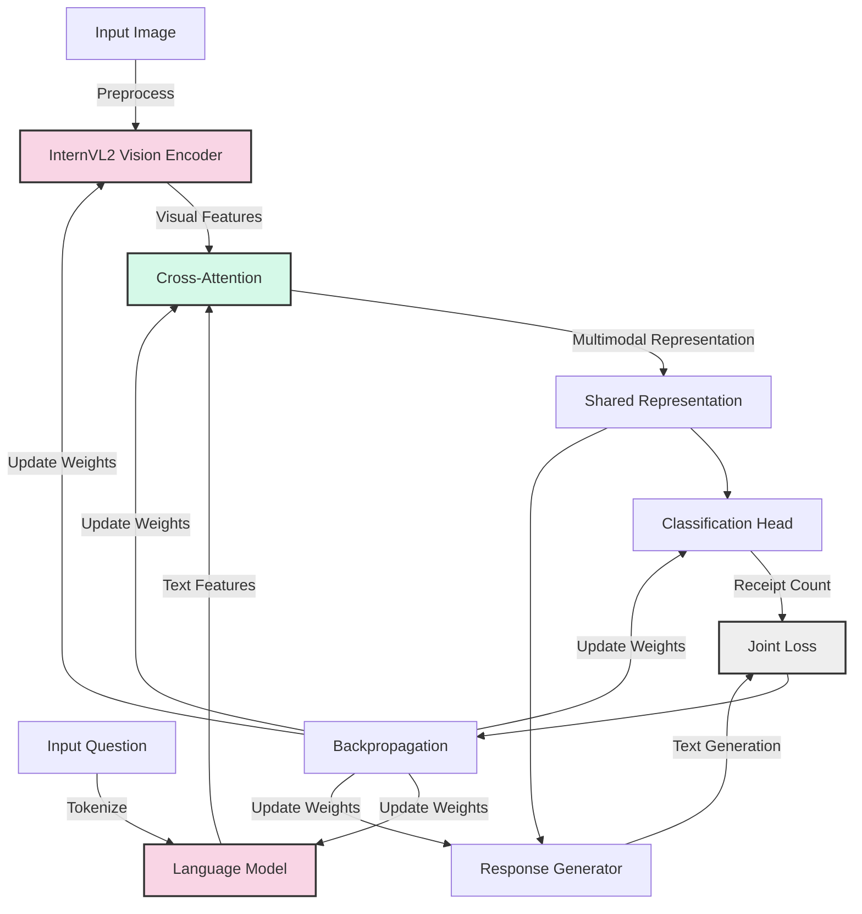

# InternVL_V2 

Advanced multimodal vision-language model for receipt and tax document analysis with multitask learning, synthetic data generation, and streamlined architecture.

## Project Overview

This project enhances the InternVL2 vision-language model for document analysis focusing on four key components:

1. **Multitask Learning**: Jointly trains for receipt counting and question answering with a unified approach
2. **Synthetic Data Generation**: Creates realistic synthetic receipts and tax documents with question-answer pairs
3. **Streamlined Architecture**: Simplified model architecture with reduced complexity and fewer fallbacks
4. **Template-based Response Generation**: Uses structured templates to generate consistent, natural responses

## System Architecture

### Overall System Architecture



### Training Pipeline Architecture



### Question Processing Flow



### Multitask Training Architecture



## Directory Structure

The project is organized into the following structure:

- **config/**: Configuration files for all components
  - `classifier/`: Question classifier configurations
  - `model/`: Model training configurations
    - `unified_multimodal_config.yaml`: Configuration for the unified multitask model

- **data/**: Data processing and dataset modules
  - `datasets/`: Dataset class definitions
  - `generators/`: Synthetic data generation modules for receipts and tax documents
    - `receipt_generator.py`: Ab initio receipt generator
    - `tax_document_generator.py`: Ab initio tax document generator
    - `create_multimodal_data.py`: Generator for multimodal datasets with question-answer pairs

- **models/**: Model implementations
  - `classification/`: Question classifier models
  - `components/`: Shared model components
    - `projection_head.py`: Classification head, cross-attention, and response generator components
    - `template_system.py`: Template-based response generation system
    - `legacy/`: Deprecated components no longer actively used
  - `vision_language/`: Vision-language model implementations
    - `internvl2.py`: Core InternVL2 multimodal model implementation

- **scripts/**: Executable scripts for all tasks
  - `classification/`: Question classification scripts
  - `data_generation/`: Data generation scripts
    - `generate_data.py`: Generates base synthetic datasets
    - `generate_multimodal_data.py`: Generates datasets with question-answer pairs
    - `generate_unified_data.py`: Creates unified datasets for multitask training
    - `legacy/`: Deprecated data generation scripts
  - `training/`: Model training and evaluation scripts
    - `train_unified_multimodal.py`: Trains the multitask model on the unified dataset
    - `evaluate_multimodal.py`: Evaluates model performance
    - `legacy/`: Deprecated training scripts

- **utils/**: Utility functions used across the project

## Installation

```bash
# Clone the repository
git clone https://github.com/yourusername/InternVL_V2.git
cd InternVL_V2

# Option 1: Manual setup
# Create conda environment from environment.yml
conda env create -f environment.yml

# Activate environment
conda activate internvl_env

# Option 2: Automated setup
# Run the unified setup script
source setup_unified.sh
```

## Usage

### Question Classification

Train the enhanced question classifier:

```bash
PYTHONPATH=. python scripts/classification/train_enhanced_classifier.py --num-epochs 15
```

Test the classifier:

```bash
PYTHONPATH=. python scripts/classification/test_enhanced_classifier.py
```

### Synthetic Data Generation

Generate synthetic receipts and tax documents:

```bash
PYTHONPATH=. python scripts/data_generation/generate_data.py --output_dir datasets/synthetic_receipts
```

### InternVL Model Training

#### Using the Unified Dataset Approach (Recommended)

Generate unified dataset combining both tasks:

```bash
PYTHONPATH=. python scripts/data_generation/generate_unified_data.py --output_dir data/unified_dataset --num_samples 1000
```

Train the unified multimodal model:

```bash
PYTHONPATH=. python scripts/training/train_unified_multimodal.py --config config/model/unified_multimodal_config.yaml
```


Evaluate the model:

```bash
PYTHONPATH=. python scripts/training/evaluate_multimodal.py --model_path models/unified_multimodal/best_model.pt --config config/model/unified_multimodal_config.yaml
```

## Key Components

### Multitask Learning Framework

The project implements a multitask learning approach that:
- Jointly trains on receipt counting and question answering tasks
- Uses a unified dataset with aligned image-text-question-answer pairs
- Applies task-specific loss weights to balance task contributions
- Shares visual and textual feature representations between tasks
- Leverages cross-modal attention to fuse information from both modalities

### Streamlined Model Architecture

The simplified InternVL2 model architecture includes:
- **Vision Encoder**: Processes the input image to extract visual features
- **Language Model**: Processes text inputs (questions and prompts)
- **Cross-Attention**: Fuses visual and textual features into a multimodal representation
- **Classification Head**: Predicts the number of receipts in the image
- **Response Generator**: Generates natural language answers from multimodal context
- **Template System**: Provides structured templates for consistent response generation

### Unified Dataset Approach

The unified dataset structure combines:
- Images containing receipts or tax documents (0-5 receipts per image)
- Natural language questions about the documents
- Ground truth answers for each question
- Receipt count labels for each image
- Multiple question types:
  - DOCUMENT_TYPE: Questions about the type of document
  - COUNTING: Questions about counting documents
  - DETAIL_EXTRACTION: Questions about specific details
  - PAYMENT_INFO: Questions about payment methods
  - TAX_INFO: Questions about tax-related information

### Advanced Data Generation

The project includes ab initio (from first principles) data generators for:
- Australian receipts with realistic product listings, pricing, and layouts
- Australian tax documents with proper formatting and tax-specific fields
- Question-answer pairs tailored to each document type
- Collage generation for multi-receipt images

## Multitask Learning Advantages

The unified multitask approach offers several advantages over separate models:

1. **Improved Learning Efficiency**:
   - Shared representations capture common features relevant to both tasks
   - Knowledge transfer between related tasks improves overall performance
   - Reduced total parameters compared to separate models for each task

2. **Better Generalization**:
   - Learning multiple tasks from the same data provides regularization effects
   - Multi-objective optimization helps avoid overfitting to a single task
   - Increased robustness to variations in input data

3. **Resource Efficiency**:
   - Single model deployment instead of multiple specialized models
   - Shared computation for vision and language processing
   - Less memory usage during training and inference

4. **Simplified Development Workflow**:
   - Unified dataset preparation and training pipeline
   - Single configuration and evaluation process
   - Streamlined architecture with fewer components to maintain

## Contributing

Contributions are welcome! Please follow these steps:

1. Fork the repository
2. Create a feature branch (`git checkout -b feature/amazing-feature`)
3. Make your changes
4. Commit your changes (`git commit -m 'Add amazing feature'`)
5. Push to the branch (`git push origin feature/amazing-feature`)
6. Open a Pull Request