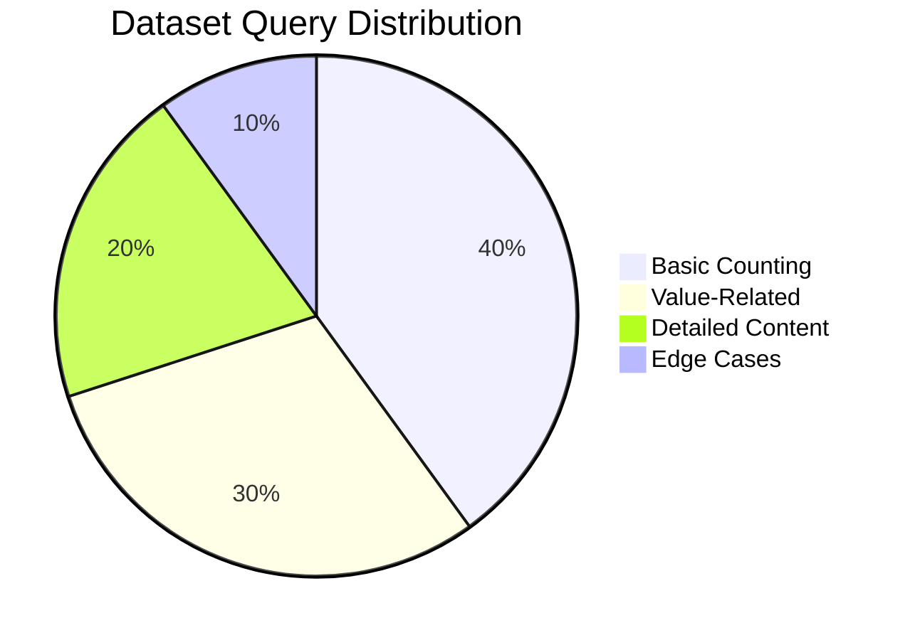
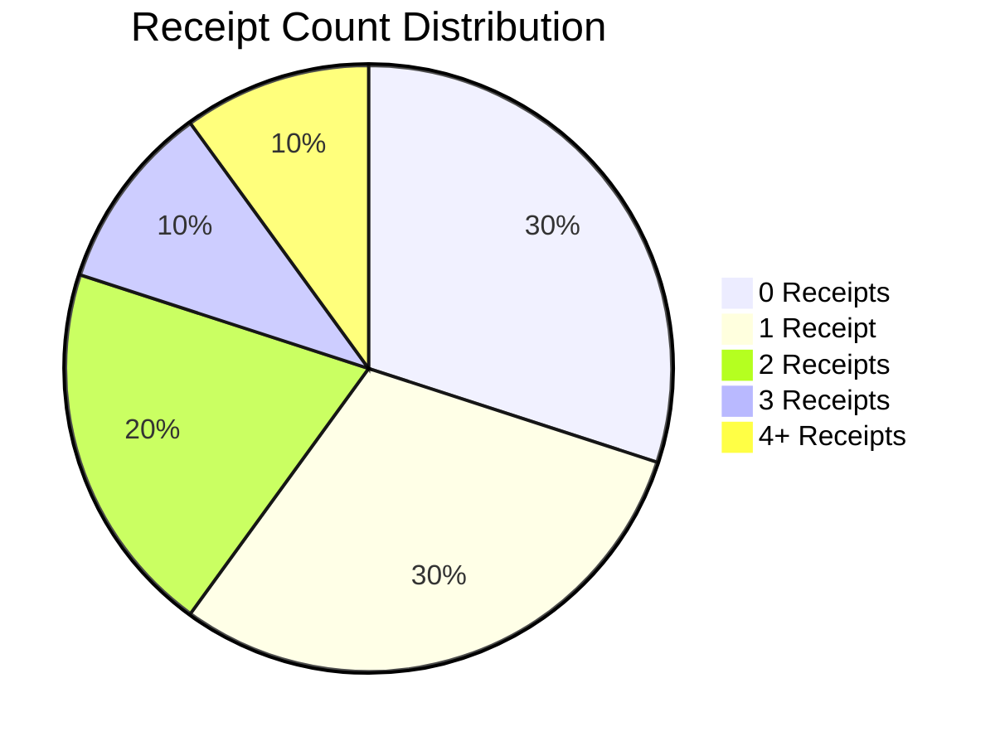

# Phase 2: Multimodal Dataset Implementation

## Overview

This document summarizes the implementation of Phase 2 of the InternVL Receipt Counter project, which focuses on creating a multimodal dataset for vision-language integration. This phase builds on the vision-only receipt counting functionality and extends it to support question-answering about receipts.

## Key Components Implemented

### 1. Multimodal Data Generation

We've created a comprehensive system for generating multimodal data that includes:

- **Question-Answer Generation**: A template-based approach for generating diverse question-answer pairs related to receipts
- **Receipt Generation**: Integration with the existing synthetic receipt generation system
- **Metadata Extraction**: Extraction of key receipt information (values, store names, dates, payment methods)
- **Dataset Creation**: Tools for creating, splitting, and organizing multimodal datasets

The data generator creates four primary question types:
- **Counting questions**: "How many receipts are in this image?"
- **Existence questions**: "Are there any receipts visible?"
- **Value questions**: "What is the total value of these receipts?"
- **Detail questions**: "Which store has the highest receipt value?"

### 2. Dataset Classes

We've implemented dataset classes to support both the original vision-only functionality and the new multimodal capabilities:

- **ReceiptDataset**: Original implementation for receipt counting (preserved)
- **MultimodalReceiptDataset**: New implementation that handles both images and text
- **Custom Collate Function**: Specialized batch assembly for mixed-modal data
- **Enhanced DataLoader Creation**: Support for both dataset types in a single interface

### 3. Loss Functions

We've created loss functions specifically designed for multimodal training:

- **MultimodalLoss**: Combines classification loss and language modeling loss
- **Weighted Loss Components**: Configurable weighting between vision and language tasks
- **Masked Language Modeling**: Attention mask-aware loss calculations

### 4. Testing and Configuration

We've developed tools for testing and configuring the multimodal system:

- **Test Script**: A dedicated script for testing multimodal models
- **Configuration Template**: A YAML configuration for multimodal training
- **Documentation**: Clear explanations of the multimodal functionality

## Dataset Distribution

The multimodal dataset follows this distribution for question types:



And this distribution for receipt counts:



## Usage Instructions

### Generating Multimodal Data

```bash
python scripts/generate_multimodal_data.py --num_samples 1000 --output_dir data/multimodal
```

### Training with Multimodal Data

```bash
python main.py --config config/multimodal_config.yaml --mode train
```

### Testing Multimodal Models

```bash
python scripts/test_multimodal_model.py --model_path /path/to/model --image_path /path/to/image.png --questions "How many receipts are in this image?" "What is the total value?"
```

## Next Steps

The implementation of Phase 2 sets the foundation for Phase 3, which will focus on training the multimodal model and improving its performance. The key next steps are:

1. Fine-tuning the vision-language model on the generated dataset
2. Evaluating model performance across different question types
3. Enhancing model response quality through iterative training
4. Optimizing model efficiency for deployment

This completes Phase 2 of the project, delivering all the necessary components for multimodal training as specified in the project requirements.