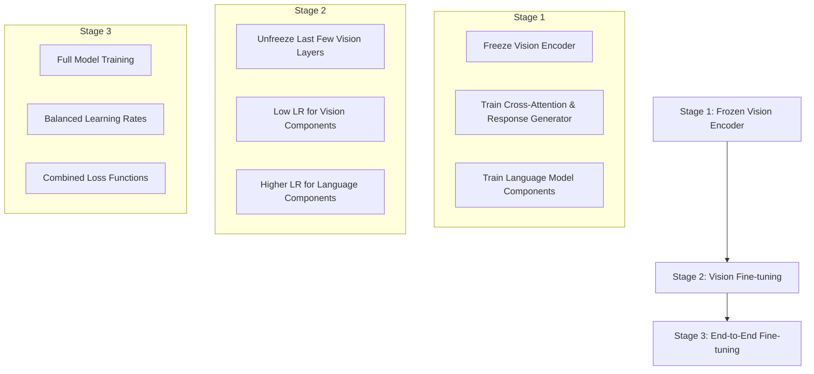
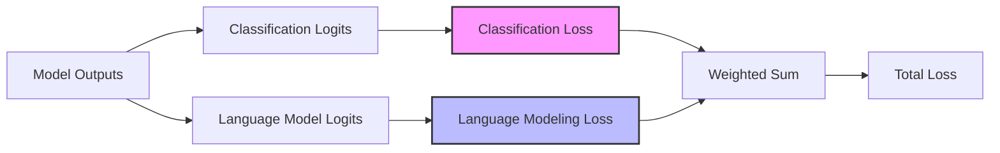
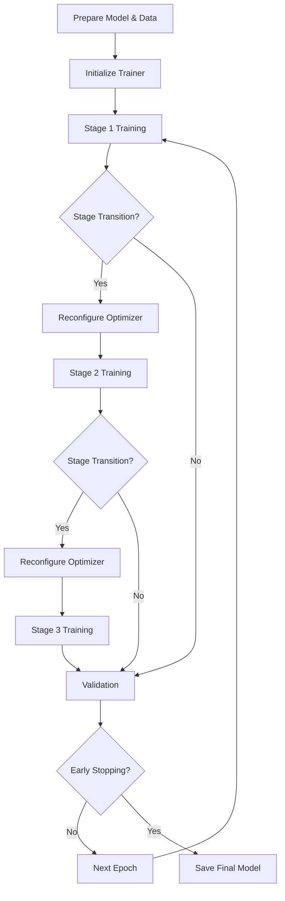
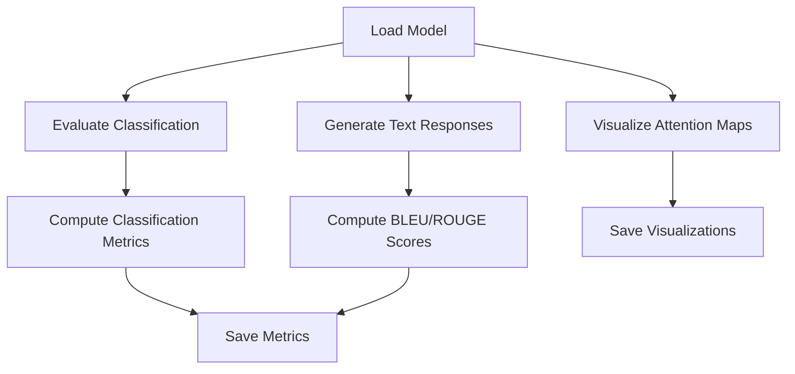

# Phase 3 Implementation: Training Pipeline

## Overview

This document summarizes the implementation of Phase 3 of the vision-language integration project for the InternVL Receipt Counter. Phase 3 focuses on the training pipeline, including multi-stage training strategies, custom loss functions, and evaluation metrics.

## Key Components

### 1. MultimodalTrainer (`training/multimodal_trainer.py`)

The core of Phase 3 is the `MultimodalTrainer` class, which implements a sophisticated multi-stage training strategy:



#### Training Strategy Implementation

The multi-stage training approach is implemented with flexible epoch transitions and learning rate management:

1. **Stage 1: Frozen Vision Encoder**
   - Vision encoder begins frozen
   - Only trains language model, cross-attention, and response generator
   - Uses separate learning rates for different components

2. **Stage 2: Vision Fine-tuning**
   - Selectively unfreezes vision encoder (last few transformer blocks)
   - Uses a much smaller learning rate multiplier (0.01×) for vision components
   - Maintains original learning rate for language components

3. **Stage 3: End-to-End Fine-tuning**
   - Unfreezes all components
   - Uses balanced learning rates across components
   - Focuses on end-to-end refinement

### 2. Loss Functions (`training/multimodal_loss.py`)

The `MultimodalLoss` class combines classification and language modeling losses with configurable weights:



- **Classification Loss**: Cross-entropy loss for receipt counting
- **Language Modeling Loss**: Token-level cross-entropy for text generation
- **Combined Loss**: Weighted sum with configurable weights
   
### 3. Evaluation Metrics (`utils/metrics.py`)

Comprehensive metrics for both classification and language generation tasks:

#### Classification Metrics
- Accuracy
- Precision
- Recall
- F1 Score

#### Text Generation Metrics
- BLEU-1/2/3/4 Scores
- ROUGE-1/2/L Scores
- Perplexity (optional)

### 4. Training Script (`scripts/train_multimodal.py`)

A comprehensive training script that:
- Loads and configures the model
- Creates dataloaders
- Initializes the trainer
- Handles checkpointing and resumption
- Captures and logs training metrics

### 5. Evaluation Script (`scripts/evaluate_multimodal.py`)

A detailed evaluation script that:
- Evaluates model performance on test data
- Generates text for visual examples
- Visualizes attention maps
- Computes and saves all metrics

## Configuration

The training pipeline is highly configurable through the `multimodal_config.yaml` file, which includes settings for:

- Model architecture
- Training parameters
- Multi-stage training transitions
- Loss function weights
- Optimization settings
- Evaluation metrics

## Training Process



## Evaluation Process



## Key Features and Benefits

1. **Flexible Training Strategy**: Configurable stage transitions to balance vision and language components

2. **Component-Specific Learning Rates**: Different learning rates for vision, language, and cross-attention components

3. **Multi-Task Learning**: Joint optimization of classification and text generation

4. **Comprehensive Evaluation**: Both quantitative metrics and qualitative visualizations

5. **Modern Optimization Techniques**:
   - Learning rate scheduling
   - Gradient accumulation
   - Gradient clipping
   - Mixed precision training (optional)
   - Flash attention (when available)

## Implementation Notes

1. The training pipeline prioritizes stability over speed, using conservative hyperparameters by default (e.g., disabling FP16 mixed precision, using moderate learning rates).

2. Stage transitions are defined by epoch numbers to ensure consistent behavior, but these are fully configurable.

3. Text generation evaluation uses efficient sampling during training and more thorough beam search during final evaluation.

4. Attention visualization provides valuable insight into which parts of the image the model is focusing on when answering questions.

## Usage Instructions

To train the multimodal model:

```bash
python scripts/train_multimodal.py --config config/multimodal_config.yaml --output-dir models/multimodal
```

To evaluate the trained model:

```bash
python scripts/evaluate_multimodal.py --model-path models/multimodal/best_model.pt --config config/multimodal_config.yaml
```

To visualize attention for a specific image:

```bash
python scripts/evaluate_multimodal.py --model-path models/multimodal/best_model.pt --image-path path/to/image.jpg --question "How many receipts do you see?"
```