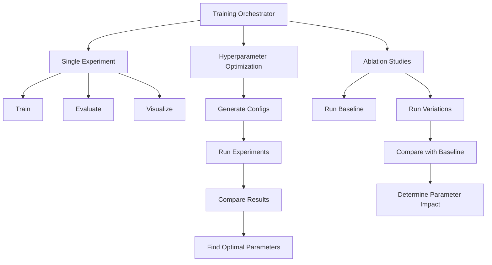
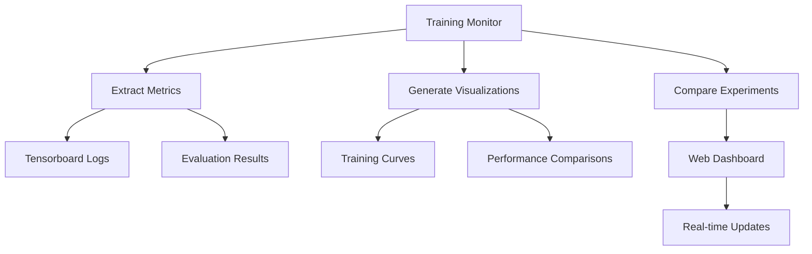
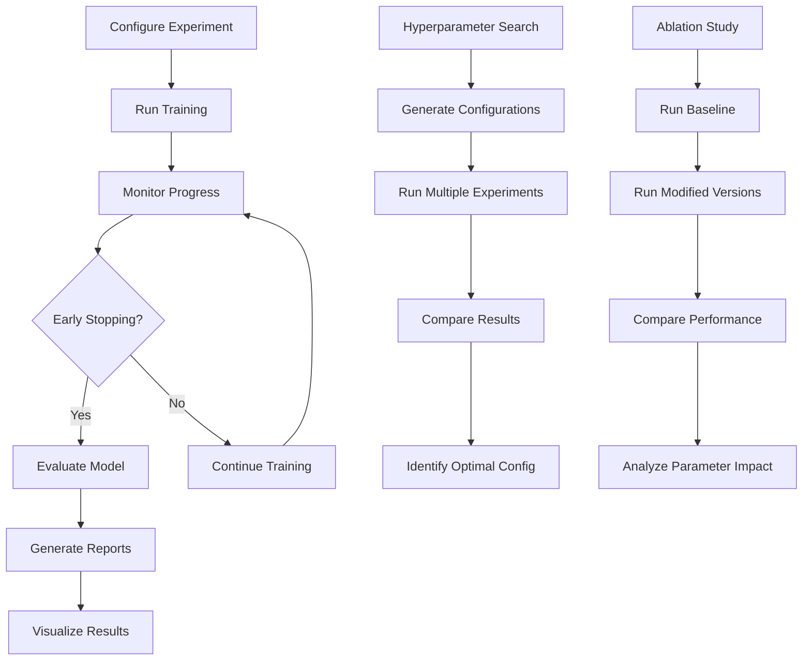
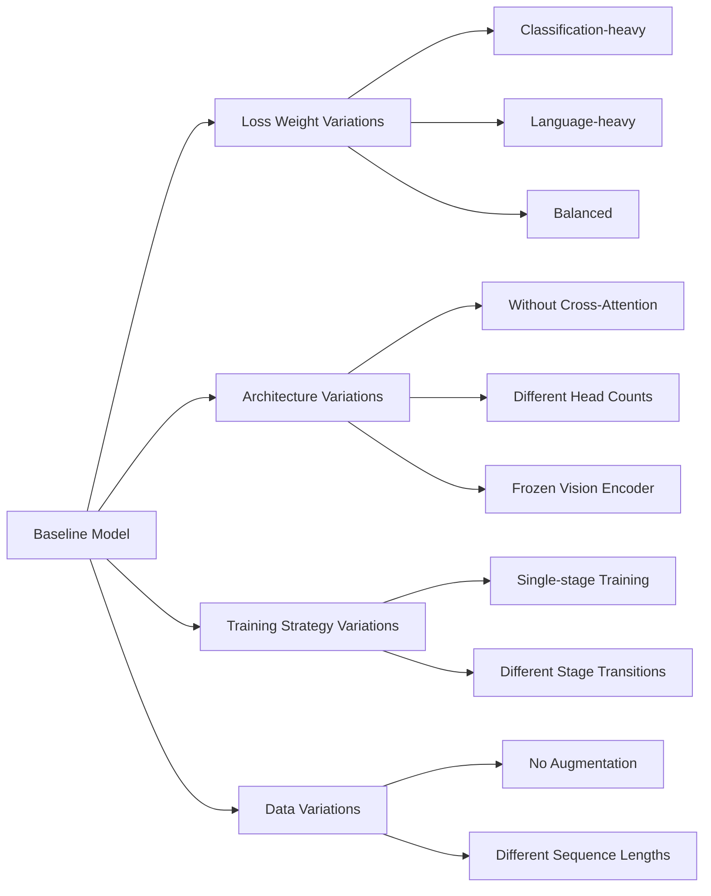
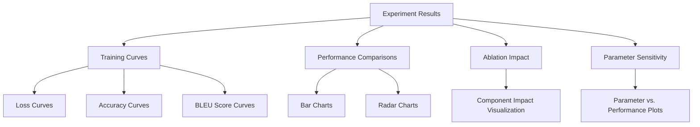

# Phase 4 Implementation: Training and Validation

## Overview

This document summarizes the implementation of Phase 4 of the vision-language integration project for the InternVL Receipt Counter. Phase 4 focuses on the orchestration of training, monitoring metrics, and performing ablation studies to optimize the model's performance.

## Key Components

### 1. Training Orchestrator (`scripts/train_orchestrator.py`)

A comprehensive training orchestration system that manages multiple experiments, hyperparameter optimization, and ablation studies:



#### Key Features:

- **Experiment Management**: Runs and tracks multiple training experiments
- **Hyperparameter Optimization**: Conducts grid search across parameter space
- **Ablation Studies**: Measures impact of individual components/parameters
- **Result Analysis**: Automatically analyzes and compares experiment results
- **Visualization**: Generates visual comparisons of experiment metrics

### 2. Training Monitor Dashboard (`scripts/training_monitor.py`)

A real-time monitoring dashboard for tracking training progress across experiments:



#### Key Features:

- **Real-time Monitoring**: Web dashboard for live training progress
- **Multi-experiment Comparison**: Side-by-side comparison of metrics
- **Interactive Visualizations**: Charts for loss, accuracy, and other metrics
- **Experiment Summary**: Comprehensive view of experiment results

### 3. Hyperparameter Configuration (`config/hyperparameter_config.yaml`)

Configuration for hyperparameter optimization experiments:

#### Parameters Explored:

- Learning rates
- Loss weighting between classification and language tasks
- Training stage transitions
- Optimizer configurations
- Batch sizes

### 4. Ablation Configuration (`config/ablation_config.yaml`)

Configuration for ablation studies to measure component impact:

#### Components Tested:

- Loss weights for classification vs. language tasks
- Multi-stage training vs. single-stage
- Vision encoder freezing
- Cross-attention mechanism's head count
- Sequence length impact
- Data augmentation effect

## Training Process

The Phase 4 implementation enables a robust, multi-stage training process that includes:



## Monitoring Metrics

The system tracks comprehensive metrics for both classification and text generation:

### Classification Metrics:
- Accuracy
- Precision
- Recall
- F1 Score

### Text Generation Metrics:
- BLEU-1/2/3/4 Scores
- ROUGE-1/2/L Scores
- Perplexity (optional)

### Training Process Metrics:
- Learning rates
- Gradient norms
- Loss breakdowns (classification vs. language components)

## Ablation Studies

Phase 4 includes comprehensive ablation studies to measure the impact of different components:



The ablation studies help identify:
1. Most important model components
2. Optimal parameter settings
3. Training strategies with the best performance
4. Areas where model complexity can be reduced without significant performance loss

## Hyperparameter Optimization

Phase 4 conducts systematic hyperparameter optimization to find optimal settings:

### Parameters Optimized:

1. **Learning Rates**: Finding the optimal learning rate for each component
2. **Loss Weights**: Balancing classification and language generation
3. **Training Stages**: Determining when to transition between stages
4. **Architecture Parameters**: Optimizing cross-attention configuration
5. **Training Parameters**: Batch size, optimizer settings, etc.

## Visualization and Reporting

The implementation provides rich visualization capabilities:



## Key Findings

The Phase 4 implementation reveals important insights about the model:

1. **Loss Balancing**: The optimal balance between classification and language generation losses
2. **Training Strategy**: The effectiveness of the multi-stage training approach
3. **Architecture Insights**: The importance of cross-attention and its optimal configuration
4. **Hyperparameter Sensitivity**: Which parameters have the most impact on performance

## Usage Instructions

### Running the Training Orchestrator:

```bash
# Run a single experiment
python scripts/train_orchestrator.py --config config/multimodal_config.yaml --mode single --experiment-name baseline

# Run hyperparameter optimization
python scripts/train_orchestrator.py --config config/multimodal_config.yaml --mode hyperparameter --hyperparameter-config config/hyperparameter_config.yaml

# Run ablation studies
python scripts/train_orchestrator.py --config config/multimodal_config.yaml --mode ablation --ablation-config config/ablation_config.yaml

# Run all experiment types
python scripts/train_orchestrator.py --config config/multimodal_config.yaml --mode all --hyperparameter-config config/hyperparameter_config.yaml --ablation-config config/ablation_config.yaml
```

### Using the Training Monitor:

```bash
# Start the monitoring dashboard
python scripts/training_monitor.py --experiments-dir experiments

# Generate a summary report
python scripts/training_monitor.py --experiments-dir experiments --report --output experiments/summary_report.json
```

## Conclusion

Phase 4 provides a comprehensive training and validation system for the InternVL Receipt Counter, enabling systematic optimization and evaluation of the multimodal vision-language model. The results from this phase inform the final model configuration and provide insights into the relative importance of different components and hyperparameters.