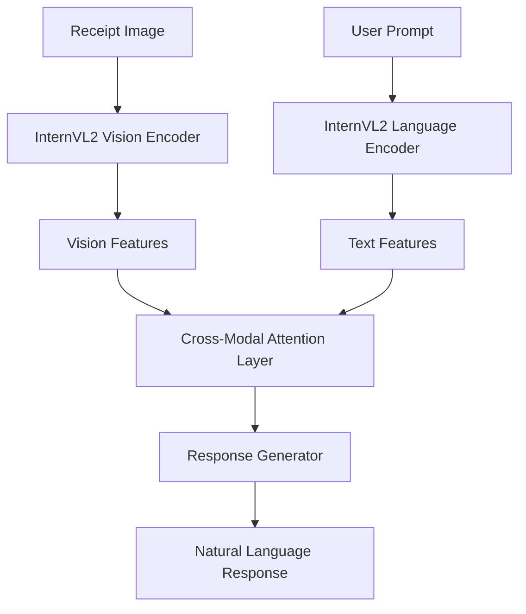
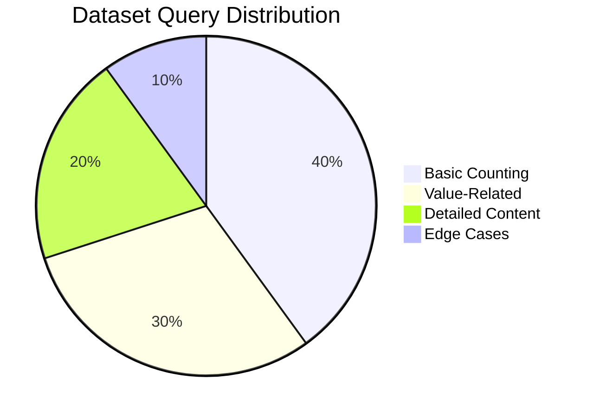
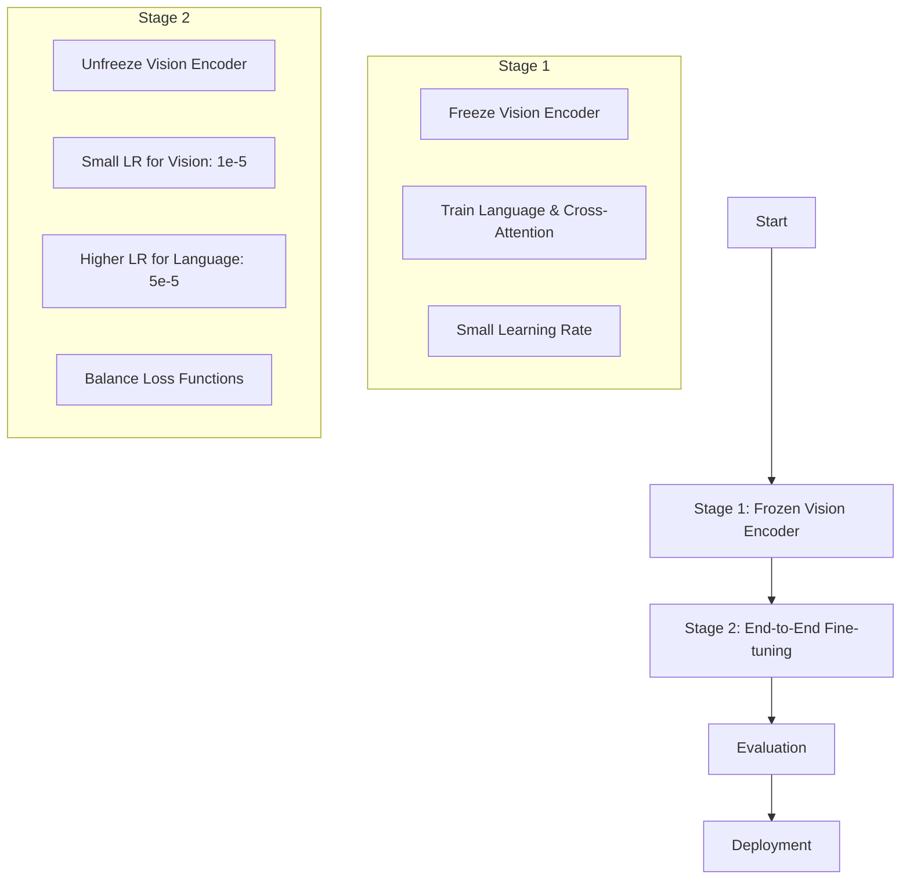
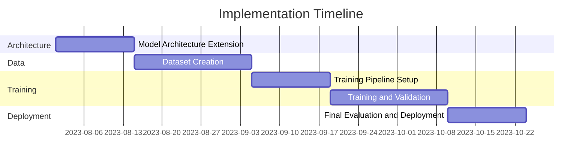

# Vision-Language Integration for InternVL Receipt Counter

## Overview

This document outlines the approach for enhancing the InternVL Receipt Counter system by integrating Language Model (LM) capabilities alongside the existing Vision Transformer (ViT) functionality. This integration will enable the system to respond to taxation officer prompts such as "How many receipts do you see?" or "What is the total value of these receipts?"

## Current System Architecture

The current system utilizes only the vision encoder from the InternVL2-5-1B model to perform receipt counting classification. It processes images through the vision encoder and uses a custom classification head to determine the count of receipts present in an image.


## Proposed Vision-Language Integration

### Architecture

We will enable the full multimodal capabilities of InternVL2-5-1B by incorporating its language model component and implementing a vision-language interface layer:



### Key Components

1. **Vision Encoder**: Utilized as currently implemented, extracting visual features from receipt images.

2. **Language Encoder**: Restoring the language component of InternVL2 that was previously deleted to save memory.

3. **Cross-Modal Attention Layer**: Implementing attention mechanisms that allow the model to focus on relevant image regions based on text queries.

4. **Response Generator**: Creating a module that generates natural language responses based on the multimodal representation.

## Implementation Plan

### 1. Model Architecture Modifications

- Restore the language model component that is currently removed in `internvl2.py`
- Modify the forward method to accept both image input and text prompt input
- Implement cross-attention between visual and textual features
- Create a response generation head for text output

```python
# Example modified forward method
def forward(self, pixel_values: torch.Tensor, text_input_ids: torch.Tensor = None) -> Dict[str, torch.Tensor]:
    """
    Forward pass for multimodal processing.

    Args:
        pixel_values: Batch of images [B, C, H, W]
        text_input_ids: Optional text prompts encoded as token IDs

    Returns:
        Dictionary with logits, embeddings, and text response
    """
    # Vision encoding
    vision_outputs = self.vision_encoder(pixel_values=pixel_values)
    image_embeds = vision_outputs.last_hidden_state

    # If text input is provided, process it
    if text_input_ids is not None:
        # Text encoding
        text_outputs = self.language_model(input_ids=text_input_ids)
        text_embeds = text_outputs.last_hidden_state

        # Cross-modal attention
        multimodal_embeds = self.cross_attention(
            text_embeds, image_embeds, image_embeds
        )

        # Generate text response
        response_output = self.response_generator(multimodal_embeds)

        return {
            "logits": self.classification_head(image_embeds.mean(dim=1)),
            "embeddings": image_embeds.mean(dim=1),
            "response": response_output
        }
    else:
        # Regular vision-only path for backward compatibility
        pooled_output = image_embeds.mean(dim=1)
        logits = self.classification_head(pooled_output)

        return {
            "logits": logits,
            "embeddings": pooled_output
        }
```

### 2. Training Data Requirements

To enable effective vision-language integration, we need to create a new multimodal dataset containing:

#### Data Format

Each training example should contain:
- **Image**: High-quality receipt image
- **Text Prompt**: Taxation officer question (e.g., "How many receipts do you see?")
- **Text Response**: Ground truth answer (e.g., "There are 2 receipts in this image.")
- **Metadata**: Receipt count, receipt values, etc.

#### Dataset Composition

The dataset should include:



1. **Basic Receipt Counting**
   - Prompt variations: "How many receipts are there?", "Count the receipts", etc.
   - Responses: "There are X receipts visible."

2. **Receipt Value Questions**
   - Prompt variations: "What is the total value?", "How much do these receipts sum to?"
   - Responses: "The total value of these receipts is $X.XX."

3. **Complex Queries**
   - Prompt variations: "Which receipt has the highest value?", "Are there any restaurant receipts?"
   - Responses: Detailed answers addressing specific aspects of the receipts

4. **Edge Cases**
   - Partially visible receipts
   - Receipts with unclear text
   - Mixed document types

#### Dataset Size and Distribution

- **Size**: Minimum 10,000 image-text-response triplets
- **Distribution**:
  - 40% basic counting queries
  - 30% value-related queries
  - 20% detailed content queries
  - 10% edge cases and complex scenarios

### 3. Data Collection and Generation

1. **Synthetic Data Generation**:
   - Extend current synthetic receipt generation to include text values
   - Create template-based question-answer pairs for each image
   - Implement controlled variation in question phrasing

2. **Template-Based Question Generation**:
   ```python
   Templates = [
       "How many {document_type} do you see in this image?",
       "Count the number of {document_type} present.",
       "How many {document_type} are visible?",
       "What is the total value of these {document_type}?",
       ...
   ]
   ```

3. **Template-Based Answer Generation**:
   ```python
   Answer_Templates = {
       "counting": "There {is_are} {count} {document_type} in the image.",
       "value": "The total value of the {document_type} {is_are} ${total_value}.",
       ...
   }
   ```

### 4. Training Strategy



#### Stage 1: Frozen Vision Encoder

- Freeze the pre-trained vision encoder
- Train only the language model and cross-attention components
- Use a small learning rate to preserve existing vision capabilities

#### Stage 2: End-to-End Fine-tuning

- Unfreeze the vision encoder
- Use a very small learning rate for vision components (1e-5 or smaller)
- Higher learning rate for language components (5e-5)
- Balance vision and language loss functions

#### Loss Functions

1. **Classification Loss**: Binary cross-entropy for receipt counting
2. **Language Modeling Loss**: Teacher forcing for response generation
3. **Combined Loss**: Weighted sum of both losses
   ```python
   loss = alpha * classification_loss + beta * language_modeling_loss
   ```

### 5. Evaluation Metrics

1. **Classification Accuracy**: Receipt counting accuracy
2. **BLEU/ROUGE Scores**: Text response quality compared to ground truth
3. **Perplexity**: Language model fluency
4. **Human Evaluation**: Quality assessment by taxation officers

## Implementation Roadmap



1. **Phase 1: Model Architecture Extension (2 weeks)**
   - Modify model architecture to include language components
   - Implement cross-attention mechanisms
   - Create response generation head

2. **Phase 2: Dataset Creation (3 weeks)**
   - Extend synthetic data generation to include text values
   - Implement template-based question-answer generation
   - Create validation and test sets

3. **Phase 3: Training Pipeline (2 weeks)**
   - Implement multi-stage training strategy
   - Create custom loss functions
   - Set up evaluation metrics

4. **Phase 4: Training and Validation (3 weeks)**
   - Execute training stages
   - Monitor metrics and adjust hyperparameters
   - Perform ablation studies

5. **Phase 5: Final Evaluation and Deployment (2 weeks)**
   - Comprehensive evaluation on test set
   - Human evaluation with taxation officers